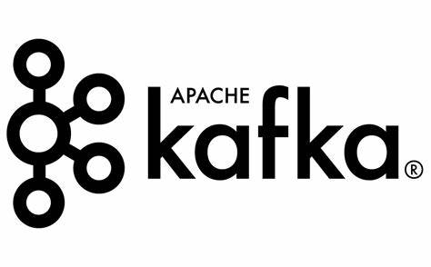

# Apache Kafka



## Apache Kafka Nedir ?

Bir kaynak ve bir hedef sistem üzerinde veri alışverişi basit bir işlemdir. Ancak birden çok kaynak ve hedef sistem işin içine girdiği zaman veri transferinde zorluklar yaşanır.

Her sistem için ayrı ayrı entegrasyon yapmak gerekebilir. Bunlar verilerin nasıl aktarılacağı, veri formatı, verilerin nasıl ayrıştırılması gerektiği gibi entegrasyonlardır. Bu entegrasynları her bir sistem için ayrı ayrı yapmak kaynak sistem üzerinde yük oluşturur. Kafka bu soruna bir çözüm olarak geliştirilmiş bir veri akışı platformudur.

Hataya dayanıklı, esnek bir mimariye sahiptir. Düşük gecikme neredeyse gerçek zamanlı(reel time) olarak veri transferini mümkün kılmaktadır.

Mesajlaşma sistemi, etkinlik takibi, log toplama, stream processing, big data entegrasyonu amacı ile kullanılabilir.

### Avantajlar

- **Dayanıklılık ve Kapsüllü Depolama:** Kafka, verileri disk üzerinde kapsüllü bir şekilde saklayarak dayanıklılık sağlar.
- **Yüksek İşleme Kapasitesi:** Kafka, büyük miktardaki veriyi hızlı bir şekilde işleyebilme yeteneğine sahiptir.
- **Akış İşleme:** Veri akışını işleme ve analiz etme konusunda güçlüdür.
- **Geniş Topluluk Desteği:** Büyük bir açık kaynak topluluğu ve geniş bir ekosisteme sahiptir.

### Dezavantajlar

- **Kurulum ve Yapılandırma Karmaşıklığı:** Kafka'nın kurulumu ve yapılandırması diğer bazı çözümlere göre daha karmaşıktır.
- **Yüksek Disk Kullanımı:** Verilerin diske yazılması dayanıklılığı artırırken, disk alanı gereksinimini de artırır.

## Kafka Temel Kavramları

| Element             | Tanım                             |
|---------------------|-----------------------------------|
|**Topic**|Mesajların tutulduğu yerdir. Veritabanındaki tablo yapısına benzetebiliriz. Bir veya birden çok patition'dan meydana gelirler.|
|**Partition**|Mesajlar bu partition isimli yapılara eklenirler. Partition'ların 0'dan başlayan numaraları vardır. Mesajlar partition'lara sıralı ve değiştirilemez olarak eklenirler ve her bir mesajın artan bir id'si(offset) olur. Mesajlar okuma işleminden sonra silinmez ve tekrar erişilebilir. Bu partition yapıları sayesinde okuma ve yazma işlemleri paralel olarak gerçekleştirilebilir. Mesajların yeri garanti edilir. Mesela 0.partition'nın 4 nolu offsetindeki mesaj, 0.partition'nın 5 nolu offsetindeki mesajdan önce yazılmıştır ve önce okunacaktır. Ancak 1.partition'da 8 nolu offset'teki mesaj hepsinden daha önce yazılmış olabilir. Partitionlar arasında hangi mesajın daha önce okunacağının bir garantisi verilmez. Kafkada veriler sınırlı bir süre saklanırlar, sonrasında bu veriler ve offset değerleri silinirler. Topic'e yeni eklenen veriler bir kural yok ise rasgele bir partition'a atanırlar ve her zaman sona eklenirler. Offset her zaman artmaya devam eder hiçbir zaman 0'a dönmez.|
|**Broker**|Topic ve partition'ları tutuan sunuculardır. Bir çok broker **Kafka Cluster**'ı oluşturur. Bir broker'a bağlandığımızda tüm cluster'a bağlanmış oluruz. Her broker belirli partition'ları içerir. Örnek olarak 3 tane broker'ımız olsun, bir tane ex isimli bir topic topic'de ise 5 tane partition olsun. Bu partition'lar broker'lara şu şekilde dağılır. Broker-1'e 2 tane, Broker-2'ye 2 tane, Broker-3'e 1 tane olmak üzere partition'lar dağıtılır.|
|**Topic Replication**| Bir broker çöktüğünde veri kaybı olmaması ve işlerin devam etmesi gereklidir. Replication bu işi yapar. Replication, partition'u kopyalar ve herhangi bir çökme durumlarında kopyalanan partition ile devam edilir bu sayede veri kaybı yaşanmaz.|
|**Producer & Message Keys**|Topiclere veriyi yazarlar. Mesaj anahtarı belirtilmiş ise yazma işlemi anahtar değere göre yapılır. Aynı anahtar değerine sahip mesajlar aynı pertition'a yazılır.|
|**Consumer & Consumer Groups**|Topiclerden verileri okurlar. Aynı pertition içerisindeki mesajları sıralı bir şekilde okur. Birden fazla partition'dan da okuyabilir.|
|**Consumer Offset**|Kafka, consumer offset bilgilerini “__consumer_offsets” isimli topic içerisinde tutar. Bir consumer kaybedildiğinde bile, yeniden ayağa kalktığında topic içinde en son hangi mesajı okuduğunun kaydı tutulduğu için kaldığı yerden devam edebilir.|
|**Message Delivery Semantics**|Kafka, offset bilgisini yazarken 3 farklı yöntem kullanır. 1.Yöntem At Most Once: Offsett bilgisi mesaj alır almaz yazılır. Bu yöntem performanslıdır. Ancak mesaj kaybı söz konusu olabilir. 2.Yöntem At Last Once : Offset bilgisi mesaj işlendikten sonra yazılır. Mesaj işlenirken bir hata olursa mesaj tekrar okunur. En çok tercih edilen yöntemdir. 3.Yöntem Exactly Once: Bu model sadece Kafka - Kafka iş akışı modellerinde kullanılır.|
|**Zookeeper**|Kafka brokerlarını yönetir. Once zookerper ayağa kalkar sonra kafka broker'ları ayağa kaldırırlır. Cluster içerisinde yalnızca bir tane zookeeper olmak zorundadır.|

## Kafka Kurulumu

Kafka kurulumunu docker üzerinden gerçekleştiricez.

```docker
docker-compose up -d
```

Spring boot dependency

```xml
<dependency>
    <groupId>org.springframework.kafka</groupId>
    <artifactId>spring-kafka</artifactId>
</dependency>
```
